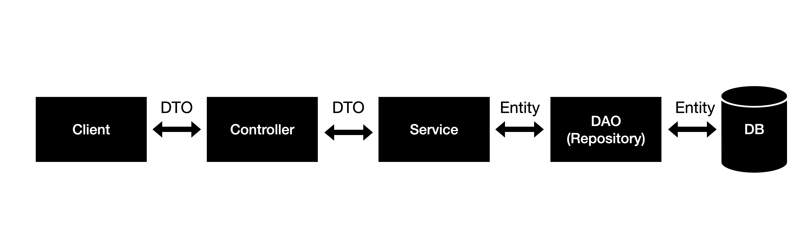

sudo apt install mariadb-server

# Database Operation
```
sudo mysql -u root
CREATE USER 'flature'@localhost IDENTIFIED BY 'aroundhub12#';
GRANT ALL PRIVILEGES ON *.* TO 'flature'@localhost IDENTIFIED BY 'aroundhub12#';
create database springboot;
FLUSH PRIVILEGES;
```

# Spring Architecture


- DTO
- DAO
- Repository
- Entity

# Ref
- https://dahye-jeong.gitbook.io/spring/spring/2020-04-12-layer (Korean)
